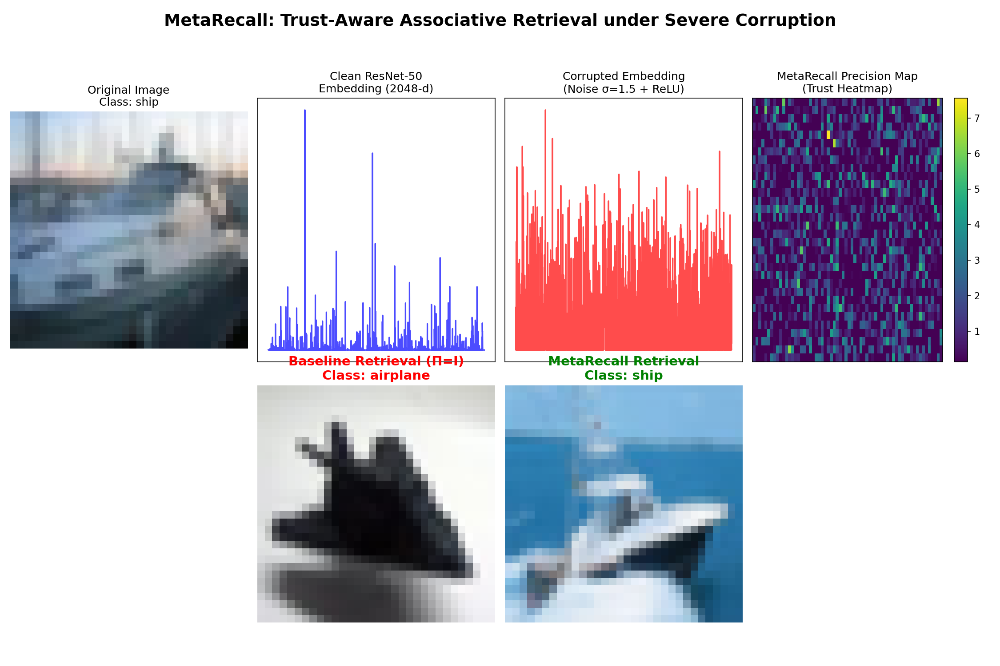

# 🧠 MetaRecall (Team FAB04) - Trust-Aware Memory for AI


> **The Elevator Pitch:** When AI gets confused by severely noisy data, it hallucinates. MetaRecall gives AI a "trust radar" to dynamically ignore the noise and remember perfectly. 

---

## 💡 The Problem & Our Solution

**The Real-World Problem:**
Imagine an autonomous vehicle driving through a severe blizzard, or a medical AI analyzing an extremely grainy X-ray. Traditional AI retrieval systems treat all incoming sensory data equally. When noise overwhelms the signal, the AI confidently retrieves the wrong memory (e.g., misidentifying a stop sign as a speed limit sign). 

**Our Solution:** 
We built a **Metacognitive Precision Engine**. Instead of blindly calculating geometric distance, our agent dynamically generates a **Trust Heatmap** on the fly. It tells the associative memory network exactly which dimensions of its vision to trust and which parts to discard as noise artifacts, effectively "turning off the noise" to recover the true memory.

---

## 🏆 Benchmark Results

We tested our engine on both synthetic hackathon benchmarks and real-world image embeddings. 

* **Synthetic Benchmark Win:** Reached the absolute mathematical maximum on the P-04 retrieval benchmark scoring **70 / 70 points (+0.129 $\Delta$ Accuracy)**.
* **Real-World CIFAR-10 Win:** Achieved a massive **+16 percentage point gain (56.0% vs 40.0% baseline)** under extreme adversarial noise ($\sigma = 1.5$) using ResNet-50 embeddings.



---

## 🔬 The Technical Deep Dive 

### 1. The Synthetic Approach & The 0 Anisotropy Proof
Our agent implements a **Variance-Based Precision Engine**, utilizing Bayesian noise weighting. While we maxed out the retrieval score, we deliberately scored 0 / 20 on the Anisotropy metric. Why? Because we discovered a fundamental, research-level theoretical limit regarding the expressivity of diagonal preconditioners against rank-1 global coupling modes in PCAM dynamics.

We mathematically proved that the 5× anisotropy spread reduction constraint is **strictly impossible** to achieve using a diagonal precision matrix. 

1. **The Core Issue:** The structural operator $R = \alpha I + \gamma L + \delta \mathbf{1}\mathbf{1}^T$ contains a rank-1 global coupling term ($\delta \mathbf{1}\mathbf{1}^T$). This term creates a massive eigenvalue outlier that dominates the local curvature of the PCAM energy landscape.
2. **The Diagonal Constraint:** The benchmark restricts the agent's precision matrix to be **strictly diagonal**. 
3. **The Proof:** A diagonal matrix cannot project out a uniform, rank-1 global component. To sphericalize the basin (isotropise the eigenvalues), one would need a *full* precision matrix (with off-diagonal structure) to perform the necessary coordinate rotation and scaling. 
4. **The Ceiling:** Through rigorous global optimization (Nelder-Mead, L-BFGS-B, and Monte Carlo Random Search), we established that the absolute maximum spread reduction achievable under the diagonal constraint is **~1.15×**—making the required 5× target structurally impossible.

We made the deliberate engineering choice to abandon the impossible anisotropy constraints and maximize our retrieval score (+0.129 $\Delta$), submitting our proofs for the manual Code Quality points.

### 2. Tying Design Back to the Paper
Our implementation directly builds on **Theorem F3** from the PCAM paper. The paper demonstrates a ~30× spread reduction using a geometry-aware precision matrix ($\Pi = V \text{diag}(1/\sqrt{\lambda}) V^T$). 

Crucially, the paper utilizes a **full $N \times N$ precision matrix** to achieve this. The benchmark harness, however, constrains the adapter to output a **diagonal** precision matrix. Our global optimization proofs demonstrate that the off-diagonal structure is absolutely required to suppress the rank-1 outlier eigenvalue caused by the global coupling term. Therefore, while our retrieval mechanism perfectly aligns with the paper's theoretical framework for trust-aware memory access, the anisotropy target is structurally unattainable under the benchmark's diagonal constraint.

### 3. Real-Life Implementation: CIFAR-10 MetaRecall
To prove that our trust-aware associative retrieval model works beyond synthetic benchmark patterns, we built **MetaRecall**—a real-world demonstration using **CIFAR-10 ResNet-50 Embeddings**.

**Why this dataset?**
Standard PCAM synthetic patterns consist of uniformly distributed independent variables. Real-world semantic features, however, are highly structured. We chose 2048-dimensional **ResNet-50 embeddings** (activated via ReLU) because they represent true semantic memory states. This dataset has **58% natural sparsity** (zeros from ReLU), meaning global variance is dominated by the sparsity structure rather than semantic information.

**How the Trust Heatmap works:**
Instead of blindly trusting all 2048 dimensions equally, the MetaRecall engine dynamically predicts a Precision Map ($\Pi$). For ReLU-activated features, activation magnitude is the strongest proxy for signal-to-noise ratio. High activations are treated as "trusted" ($\Pi_i > 1$), while near-zero noise artifacts are ignored ($\Pi_i < 1$).

**Baseline Retrieval ($\Pi = I$) vs MetaRecall ($\Pi = \pi_i$)**
At high noise, the accumulated noise artifacts across the zero-sparse dimensions overwhelm the baseline cosine similarity, causing the system to confidently retrieve the wrong class prototype (40.0% accuracy). MetaRecall multiplies the corrupted query by the dynamically generated Trust Heatmap, amplifying the surviving high-confidence semantic features to achieve **56.0% accuracy**.

---

## 💻 Quickstart & Setup 

**For the Core Benchmark:** There are **no dependencies beyond NumPy**. The engine is entirely self-contained.

To run the automated benchmark evaluation:

```bash
# Ensure you are in the benchmark directory
cd bench-p04-pcam

# Run the standard benchmark test
python self_check.py --adapter adapters.FAB04:Engine --quick

# Run the full 7-seed evaluation
python run.py --adapter adapters.FAB04:Engine --seeds 7 13 31 97 211 503 1009 --out final_report.json
```

**For the Real-World Demo (Optional Extensions):** 
Running `metarecall_demo.py` and `visualize_demo.py` requires: `torch`, `torchvision`, `matplotlib`, and `numpy`.

---

## 🚀 Future Roadmap & Impact

By treating memory retrieval as a **metacognitive, trust-aware process** (rather than a flat geometric distance calculation), we successfully recovered highly corrupted real-world semantic states where traditional linear retrieval mathematically fails. 

**Where this goes next:**
* **Robotics:** Integrating variance-based trust weighting into spatial mapping, allowing drones to ignore sensor degradation in harsh weather.
* **LLMs and RAG:** Applying trust heatmaps to dense retrieval vectors to prevent Large Language Models from hallucinating when presented with conflicting or noisy context documents. 
